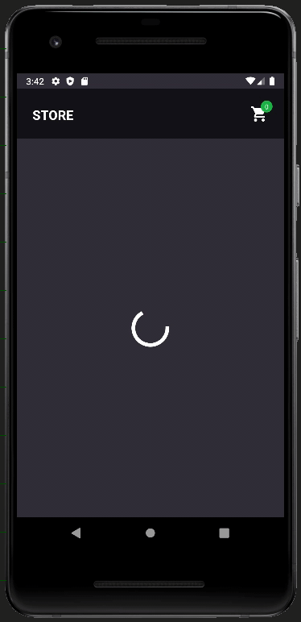

<h1 align="center">
    
    <br>
    Store Challenge
</h1>

<p align="center">
  

  

  <a href="https://www.codacy.com/app/heberpedro/store-challenge?utm_source=github.com&amp;utm_medium=referral&amp;utm_content=heberpedro/store-challenge&amp;utm_campaign=Badge_Grade">
    
  </a>

  
  <a href="https://github.com/heberpedro/store-challenge/commits/master">
    
  </a>

  <a href="https://github.com/heberpedro/store-challenge/issues">
    
  </a>

  
</p>

<h4 align="center">
    Store App with React Native and Redux.
</h4>

<p align="center">
  <a href="#rocket-technologies">Technologies</a>&nbsp;&nbsp;&nbsp;|&nbsp;&nbsp;&nbsp;
  <a href="#information_source-how-to-use">How To Use</a>&nbsp;&nbsp;&nbsp;|&nbsp;&nbsp;&nbsp;
  <a href="#memo-license">License</a>
</p>

<div align="center" >
  
</div>

## :rocket: Technologies

- [TypeScript](https://www.typescriptlang.org/)
- [react-navigation](https://reactnavigation.org/)
- [axios](https://github.com/axios/axios)
- [styled-components](https://www.styled-components.com/)
- [redux](https://redux.js.org/)
- [redux-saga](https://redux-saga.js.org/)
- [jest](https://jestjs.io/pt-BR/)
- [testing-library](https://testing-library.com/)
- [Husky](https://typicode.github.io/husky/#/)
- [VS Code][vc] with [EditorConfig][vceditconfig], [Prettier][vcprettier] and [ESLint][vceslint]

## :information_source: How To Use

To clone and run this application, you'll need [Git](https://git-scm.com), [Node.js v10.16](nodejs) or higher + [Yarn v1.13][yarn] or higher installed on your computer. From your command line:

```bash
# Clone this repository
$ git clone https://github.com/heberpedro/store-challenge

# Go into the repository
$ cd store-challenge

# Install dependencies
$ yarn install

# Start React Native Server
$ yarn start

# Run the app (Android)
$ yarn android

# Run the app (iOS)
$ yarn ios
```

## :memo: License

This project is under the MIT license. See the [LICENSE](https://github.com/heberpedro/store-challenge/blob/master/LICENSE) for more information.

---

Made with ♥ by Heber Victor :wave: [See my linkedin](https://www.linkedin.com/in/heber-pedro/)

[nodejs]: https://nodejs.org/
[yarn]: https://yarnpkg.com/
[vc]: https://code.visualstudio.com/
[vceditconfig]: https://marketplace.visualstudio.com/items?itemName=EditorConfig.EditorConfig
[vcprettier]: https://marketplace.visualstudio.com/items?itemName=esbenp.prettier-vscode
[vceslint]: https://marketplace.visualstudio.com/items?itemName=dbaeumer.vscode-eslint
